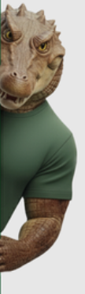
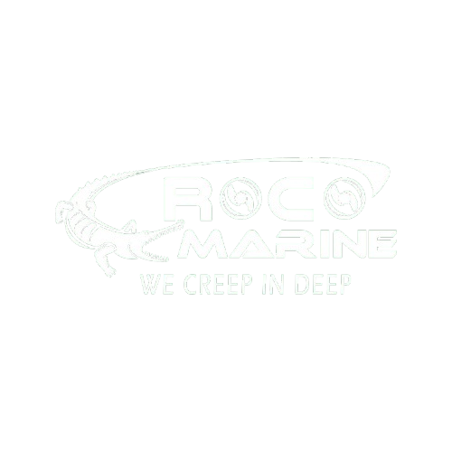

  
  

<h1 align="center">
 Training Improvement Ideas
</h1>

<em style="color:#00cc55;">We Creep In Deep</em>

---

## Purpose

This document collects proposed improvements for how the CrocMarine team works — research, media/vision collaboration, avoiding duplicated effort, and standardizing how assignments are shared across the team.

---

## 1. Research Phases — Improve Search & Resource Variety

Introduce a dedicated **research/reading phase** before starting new tasks, so the team pulls from a wider and more reliable set of sources instead of relying on the first result found.

- Set aside time at the start of each assignment to search and review multiple sources (papers, docs, forums, prior internal work).
- Keep a shared list of trusted references and tools per topic, so the next person doesn't start from zero.
- Compare at least 2–3 sources/approaches before committing to a method.

## 2. Media & Vision Team Collaboration

Currently, vision-related outputs (e.g., raw OpenCV results) are not directly usable by the media team. Instead of handing off raw technical output, define **joint assignments** where the two teams work toward a shared, usable deliverable.

**Example:** Instead of just an OpenCV detection/processing result on a CrocMarine photo, the assignment becomes: *"Add the CrocMarine logo to the post/photo automatically at the detected seam/edge."*

- Vision team handles detection (where the logo should go).
- Media team handles the branding/creative placement (how it should look).
- Exact workflow and tools to be discussed and finalized in a follow-up meeting.

## 3. Avoid Repeating Work

If a task has already been completed and works correctly, **do not redo it**.

- Before starting a new assignment, check the shared repo/log for existing solutions.
- If something needs improvement rather than a full redo, say so explicitly and build on the existing work.
- This saves time and keeps effort focused on new problems.

## 4. Standard Assignment Template + Knowledge Sharing

All assignments should be documented using a **common template** that includes the CrocMarine logo/branding, so that:

- Every team member has the opportunity to document and share what they learned.
- Completed assignments are published to our shared repo.
- Other members ("mates") can reuse this knowledge instead of researching from scratch.

> Every assignment doc should carry the CrocMarine logo in the header (see example above) to keep a consistent, recognizable format across the repo.

---

## Summary

| # | Idea | Goal |
|---|---|---|
| 1 | Research phase before tasks | Better sources, more variety |
| 2 | Joint media + vision assignments | Practical, branded output instead of raw technical results |
| 3 | No repeated work | Save time, build on what's done |
| 4 | Standard branded template | Shared knowledge, published to repo, reusable by the team |

---

CrocMarine Internal Docs

